# IPL Winning Team Prediction 🏏  

## 🌟 Project Overview  
The **IPL Winning Team Prediction** project leverages machine learning techniques to predict the outcomes of Indian Premier League matches. This project analyzes historical match data, player performances, and various match conditions to develop a reliable prediction model.  

### 🚀 Features  
- 📊 Comprehensive analysis of IPL data (2008–2024).  
- 🤖 Use of robust machine learning algorithms:  
  - 🌳 Random Forest  
  - 📉 Logistic Regression  
  - 🌲 Decision Tree  
  - 📊 Naive Bayes  
- 📈 Interactive visualizations for deeper insights. 
-  🏆 Performance evaluation using metrics such as Accuracy, Precision, Recall, Sensitivity, Specificity and F1-score.  

---

## Table of Contents  
1. [Project Setup](#Project-Setup)  
2. [Data](##Data)
3. [Data Visualizations](#Data-Visualizations)
4. [Modeling](#modeling)  
5. [Results](#results)  
6. [Visualizations](#visualizations)  
7. [Future Scope](#future-scope)  

---

## 🛠️ Project Setup  

### 📋 Prerequisites  
Ensure the following tools are installed:  
- 💻 **R and RStudio**  
- 📦 Required R Libraries: `caret`, `randomForest`, `e1071`, `rpart`, `ggplot2`, and others listed in the `.Rmd` file.  

### 🔧 Steps to Run  
1. **Clone this repository**:  
   ```bash  
   git clone https://github.com/yourusername/IPL-Winning-Team-Prediction.git  
   cd IPL-Winning-Team-Prediction  
2. **Open the RMarkdown file**:
   - Open [IPL Winning Team Prediction.Rmd](IPL-Winning-Team-Prediction.Rmd) in RStudio for Visualization.
   - Open [Random-Forest Model.R](Random-Forest-Model.R) for running the model.
3. **Run the project**: Execute all code cells to preprocess data, train models, and generate predictions.

---

## 📂 Data

 1. **The project uses the IPL Complete Dataset (2008–2024)**:
    - 🏏 Matches Dataset: High-level match details (teams, scores, venues, results).
    - 🏟 Deliveries Dataset: Ball-by-ball data for granular analysis.
 2. **🧹 Data Cleaning & Preparation**:
    - 🚫 Removed irrelevant columns (e.g., City, ID).
    - 🛠 Handled missing values and standardized team names.
    - 🔢 Converted categorical data to numerical for model compatibility.

---

## 📊 Data Visualizations

A. Plot 1: Runs by Man of the Match

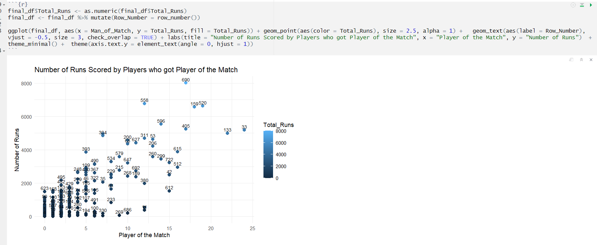


B. Plot 2: Wickets by Player of Match

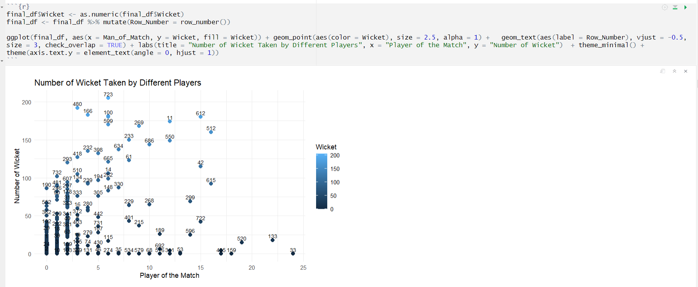

C. Plot 3: Man of the Match

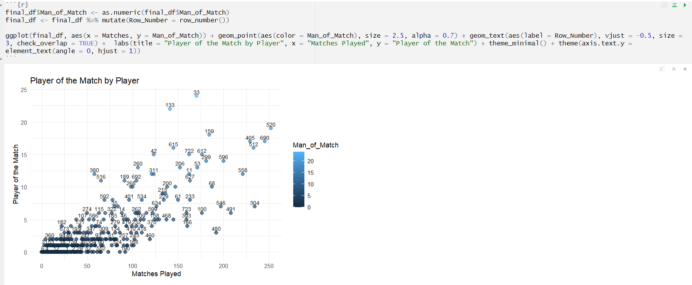

D. Plot 4: Batsman Strike Rate

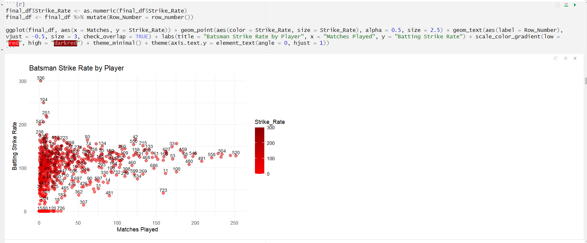

E. Plot 5: Catches by Players

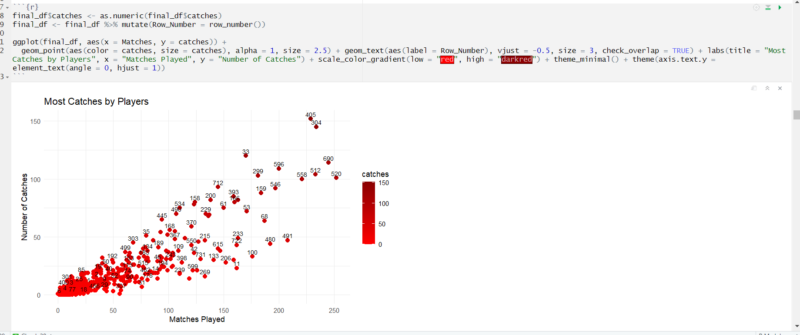

F. Plot 6: Bowling Economy

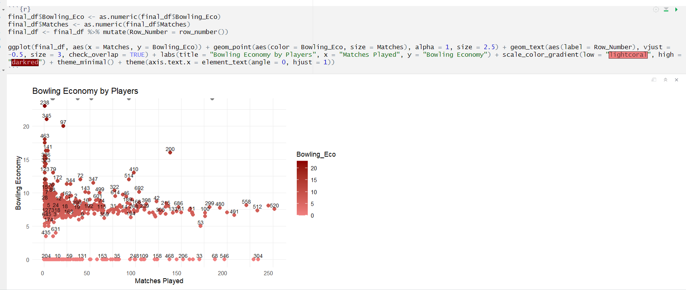

G. Plot 7: Most Sixes

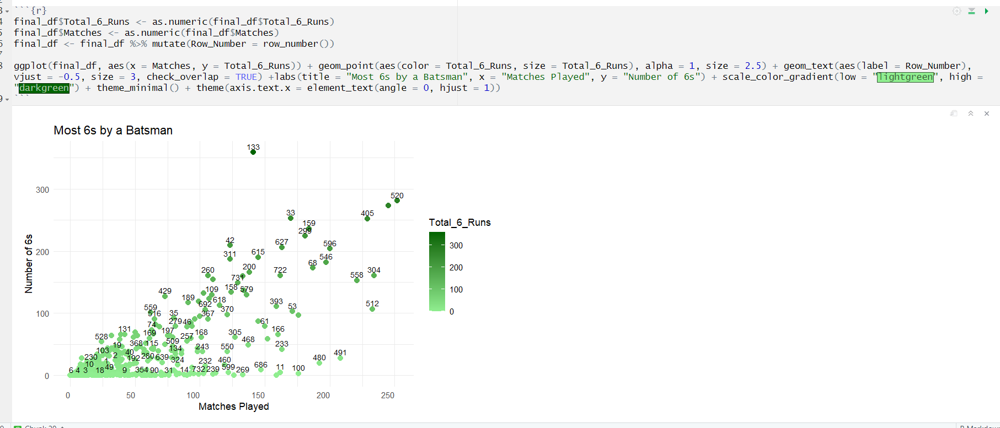

H. Plot 8: Most Fours

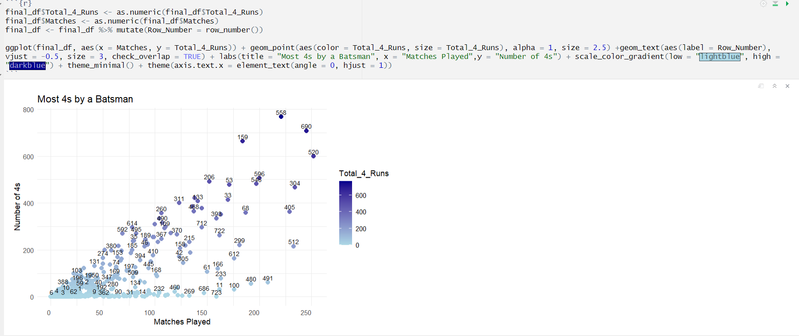

I. Plot 9: Most Dot Balls

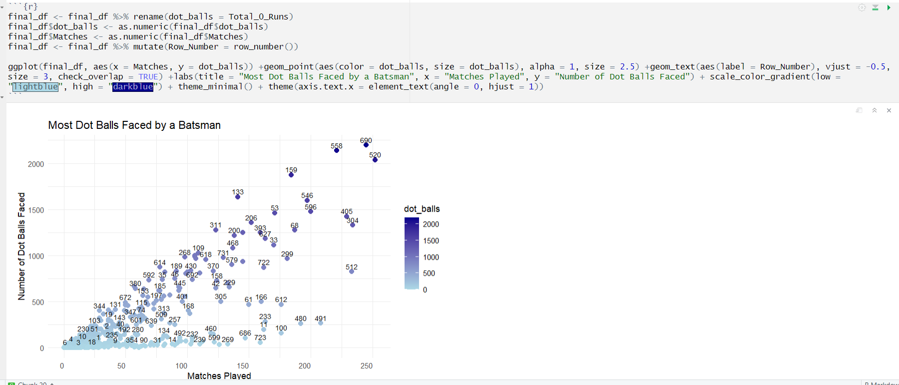

J. Plot 10: Ratio of Out vs Not Out

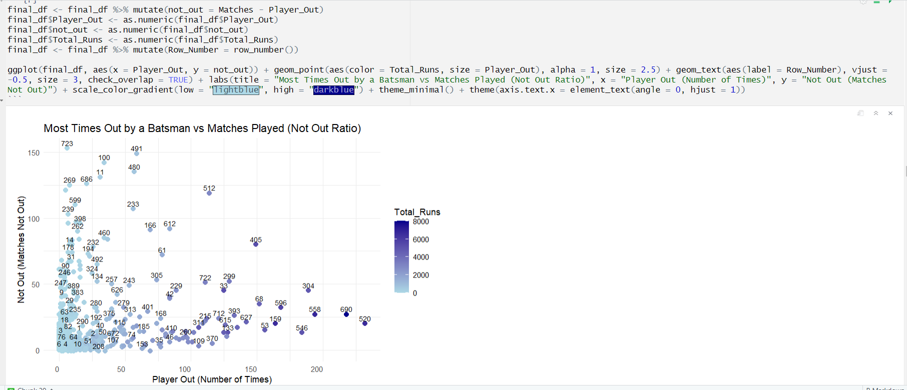

K. Plot 11: Top 20 Batsman

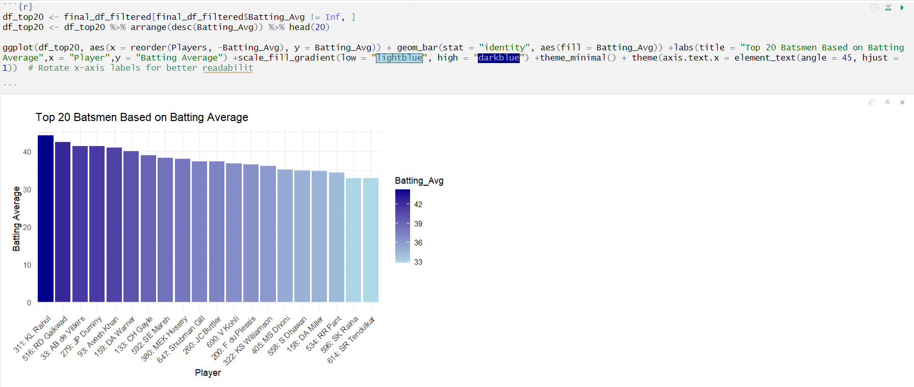

L. Plot 12: Top 20 Bowlers

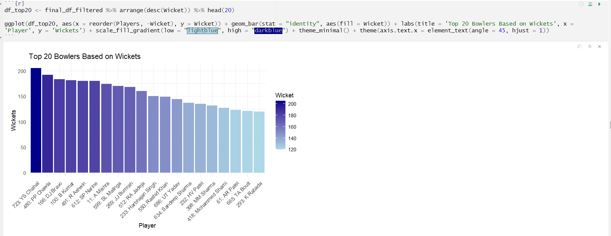

M. Plot 13: Top 10 Teams

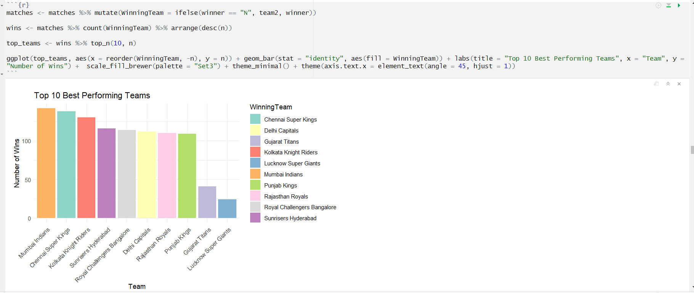

N. Plot 14: Top 10 Worst Teams

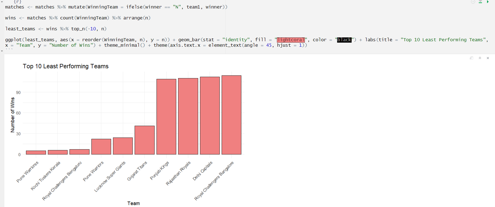

O. Plot 15: IPL Teams with IPL Cup

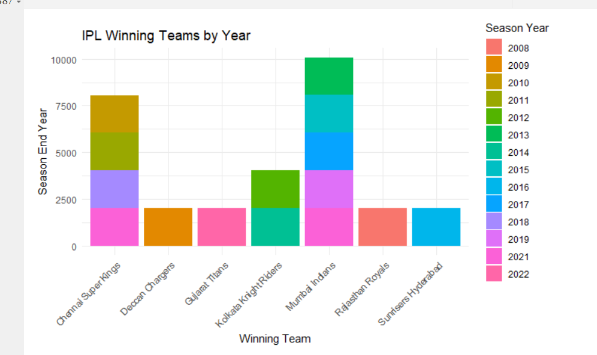

P. Plot 16: Heatmap Confusion Matrix

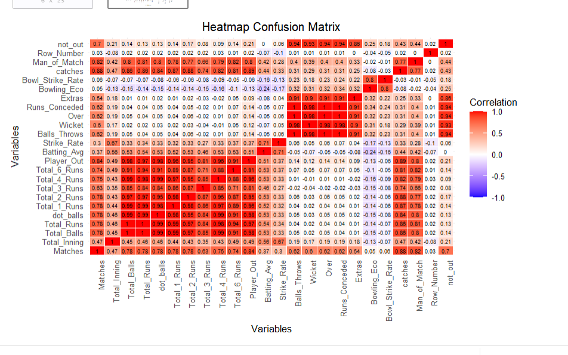

---

## 🧠 Modeling

The following algorithms were implemented:
1. **🌳 Random Forest**
2. **📉 Logistic Regression**
3. **🌲 Decision Tree**
4. **📊 Naive Bayes**

### ⚙️ Key Steps
1. 🧪 Split data into training (70%) and testing (30%) sets.
2. 📊 Evaluated using metrics like accuracy, precision, recall, and F1-score.

---

## 🎯 Results

### 🏆 Algorithm Performance Summary

| Algorithm | 🎯 Accuracy | ⚡ Precision  | 🔍 Recall | 📊 F1-Score |
| ----------| ------------ | ------------- | --------- | ------------- | 
| 🌳 Random Forest |	97.36% |	98.02% |	96.63% |	97.32% |
| 📉 Logistic Regression |	79.13% |	81.40% |	76.61% | 79.01% |
| 🌲 Decision Tree |	75.47% | 76.98% |	73.80% |	75.35% |
| 📊 Naive Bayes |	55.94% |	25.74% |	49.33% |	39.96% |

**🏅 Best Model: Random Forest** demonstrated the highest predictive accuracy.

---

## 🌟 Future Scope
- **🕒 Real-time Predictions**: Incorporate live match data for dynamic forecasting.
- **🤝 Advanced Models**: Explore XGBoost and other ensemble methods for improved accuracy.
- **💡 Explainability**: Use SHAP values to interpret predictions better.
